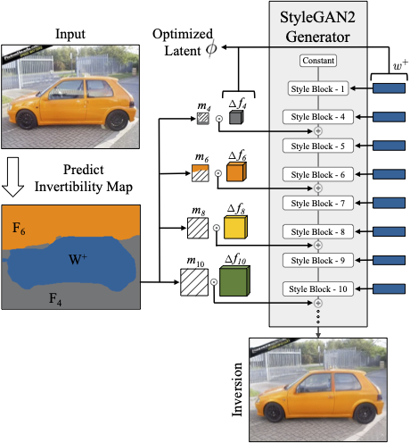
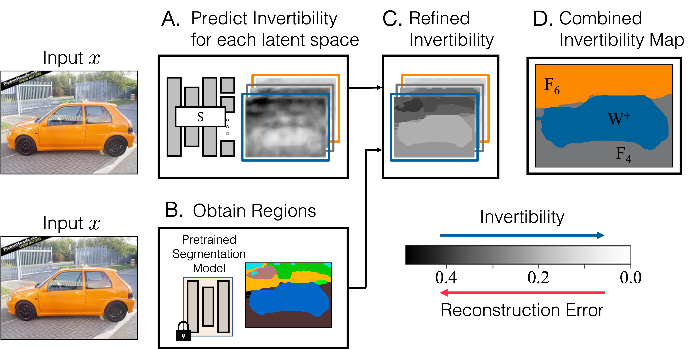

# Spatially-Adaptive Multilayer (SAM) GAN Inversion

[**Project Page**](https://www.cs.cmu.edu/~SAMInversion/) | [**Paper**](https://arxiv.org/abs/2206.08357) | [**Demo & docker image**](https://replicate.com/adobe-research/sam_inversion)

<p align="center">

</p>

We provide a PyTorch implementation of GANs projection using multilayer latent codes. Choosing a single latent layer for GAN inversion leads to a dilemma between obtaining a faithful reconstruction
of the input image and being able to perform downstream edits (1st and 2nd row).
In contrast, our proposed method automatically selects the latent space tailored for each region to balance the reconstruction
quality and editability (3rd row). <br>

[**Spatially-Adaptive Multilayer Selection for GAN Inversion and Editing**](https://arxiv.org/abs/2206.08357) <br>
[Gaurav Parmar](https://gauravparmar.com/), [Yijun Li](https://yijunmaverick.github.io/), [Jingwan Lu](https://research.adobe.com/person/jingwan-lu/), [Richard Zhang](http://richzhang.github.io/), [Jun-Yan Zhu](https://www.cs.cmu.edu/~junyanz/), [Krishna Kumar Singh](http://krsingh.cs.ucdavis.edu/) <br>
CMU, Adobe Research <br>
CVPR 2022 <br>


### Image Formation with Multiple Latent Codes
<p align="center">

</p>
We use the predicted invertibility map in conjunction with multiple latent codes to generate the final image.
First, the StyleBlocks of the pretrained StyleGAN2 model are modulated by W+ directly.
Subsequently, for intermediate feature space Fi, we predict the change in the layer’s feature value
∆Fi and add it to the feature block after masking with the corresponding binary mask mi.


### Predicting the Invertibility Map
<p align="center">

</p>
We begin with predicting how difficult each region of the image is to invert for every latent layer using our trained
invertibility network. Subsequently, we refine the predicted map using a semantic segmentation network and
combine them using a user-specified threshold. This combined invertibility map is shown on the right and
used to determine the latent layer to be used for inverting each segment in the image.


### Qualitative Results
Below we show image inversion and editing results obtained using the proposed method.
**Please see the project website for more results.**
<p align="center">

</p>


## Getting Started
Clone this repo:
```bash
git clone --recurse-submodules https://github.com/adobe-research/sam_inversion
cd sam_inversion
```
### Environment Setup
See [environment.yml](environment.yml) for a full list of library dependencies.
The following commands can be used to install all the dependencies in a new conda environment.
```bash
conda env create -f environment.yml
conda activate inversion
```

### Inversion
An example command for inverting an image for a given target image is shown below. The `--image_category` should be one of {"cars", "faces", "cats"}. The `--sweep_threshold` will perform inversion for a range of different threshold values. See [file](src/sam_inv_optimization.py) for other optional flags.
```bash
python src/sam_inv_optimization.py \
    --image_category "cars" --image_path test_images/cars/b.png \
    --output_path "output/cars/" --sweep_thresholds --generate_edits
```

### Using a Custom Dataset
To perform SAM Inversion on a custom dataset, we need to train a corresponding invertibility network.
First, perform a single layer inversion using all candidate latent spaces as shown in the command below for all images in the training set.
```bash
for latent_name in "W+" "F4" "F6" "F8" "F10"; do
    python src/single_latent_inv.py \
        --image_category "cats" --image_folder_path datasets/custom_images/train \
        --num_opt_steps 501 --output_path "output/custom_ds/train/${latent_name}" --target_H 256 --target_W 256 \
        --latent_name ${latent_name}
done
```
Next, repeat the above for the validation and test splits.
Finally, train the invertibility network as shown in the example command below.
```bash
python src/train_invertibility.py \
    --dataset_folder_train output/custom_ds/train \
    --dataset_folder_val output/custom_ds/val \
    --output_folder output/invertibility/custom_ds \
    --gpu-ids "0" --batch-size 16 --lr 0.0001
```

## Reference
If you find this code useful for your research, please cite our [paper](https://arxiv.org/abs/2206.08357).
```
@inproceedings{
parmar2022sam,
title={Spatially-Adaptive Multilayer Selection for GAN Inversion and Editing},
author={Gaurav Parmar, Yijun Li, Jingwan Lu, Richard Zhang, Jun-Yan Zhu, Krishna Kumar Singh},
booktitle={Proceedings of the IEEE/CVF Conference on Computer Vision and Pattern Recognition},
year={2022}
}
```

## Related Projects
Please check out our past GANs inversion projects:<br>
[iGAN](https://github.com/junyanz/iGAN) (ECCV 2016), [GANPaint](https://ganpaint.io/) (SIGGRAPH 2019), [GANSeeing](https://github.com/davidbau/ganseeing) (ICCV 2019), [pix2latent](https://github.com/minyoungg/pix2latent) (ECCV 2020)

## Acknowledgment
Our work is built partly based on the following repos:
 - [e4e](https://github.com/omertov/encoder4editing) - Encoder used for the `W+` inversions.
 - [StyleGAN](https://github.com/NVlabs/stylegan3) - The generative model used for the inversion.
 - [Deeplab3-xception](https://github.com/jfzhang95/pytorch-deeplab-xception) - Used for the base architectore of the invertibility prediction network.
 - [HRNet](https://github.com/CSAILVision/semantic-segmentation-pytorch), [Detectron](https://github.com/facebookresearch/detectron2) - Used for segmenting images (except faces).
 - [Face Parsing](https://github.com/zllrunning/face-parsing.PyTorch) - Used for segmenting face images.
